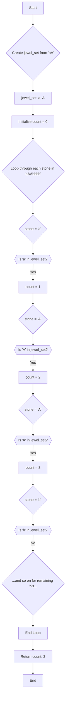

# 771. Jewels and Stones

You're given strings `jewels` representing the types of stones that are jewels, and `stones` representing the stones you have. Each character in `stones` is a type of stone you have. You want to know how many of the stones you have are also jewels.

Letters are case sensitive, so "a" is considered a different type of stone from "A".

## Example 1:

**Input:** jewels = "aA", stones = "aAAbbbb"
**Output:** 3

## Example 2:

**Input:** jewels = "z", stones = "ZZ"
**Output:** 0

## Constraints:

*   `1 <= jewels.length, stones.length <= 50`
*   `jewels` and `stones` consist of English letters.
*   The characters in `jewels` are distinct.

---

## Intuition

The core of this problem is efficiently determining if a given `stone` is present in the set of `jewels`. If we were to iterate through the `jewels` string for every `stone` we have, the process would be slow, especially if we have many stones or many jewel types. We need a way to perform very fast lookups.

## Approach

The most efficient approach leverages the power of **hash sets** (or `set` in Python) for quick membership testing. Here's the step-by-step process:

1.  **Build the Jewel Set**: First, we iterate through the `jewels` string and add each unique jewel type to a hash set. This data structure allows for average O(1) (constant time) lookups, which is crucial for performance.

2.  **Count Matching Stones**: Next, we initialize a counter to zero. We then iterate through each `stone` in the `stones` string. For each `stone`, we perform a quick lookup in our pre-built `jewel_set`.

3.  **Increment Counter**: If a `stone` is found in the `jewel_set`, it means it's a jewel, so we increment our counter.

4.  **Return Total**: After checking all `stones`, the final value of the counter represents the total number of jewels we possess.

### Visual Logic

This flowchart illustrates the process using the example `jewels = "aA"` and `stones = "aAAbbbb"`.

## Complexity

Let `J` be the length of the `jewels` string and `S` be the length of the `stones` string.

*   **Time Complexity: O(J + S)**
    *   Building the `jewel_set` takes O(J) time, as we iterate through each character in the `jewels` string once.
    *   Iterating through the `stones` string takes O(S) time. For each `stone`, checking its presence in the `jewel_set` takes, on average, O(1) time.
    *   Therefore, the total time complexity is dominated by these two linear passes: O(J + S).

*   **Space Complexity: O(J)**
    *   We use a hash set (`jewel_set`) to store the unique jewel types. In the worst case, all characters in `jewels` are distinct, so the space required for the set is proportional to the length of the `jewels` string.

## Key Learnings

*   **Hash Sets for Efficient Lookups**: This problem highlights the critical importance of choosing the right data structure. Using a hash set (Python's `set`) for membership testing provides significant performance benefits (average O(1) lookup) compared to lists (average O(N) lookup).
*   **Two-Pass Approach**: A common pattern for problems involving checking elements against a reference set is a two-pass approach: first, preprocess the reference (build the set), then iterate through the items to be checked.
*   **Readability vs. Conciseness**: While a one-liner solution might be possible, a more explicit, step-by-step implementation often enhances readability and makes the logic clearer, especially for those new to the codebase or problem.
