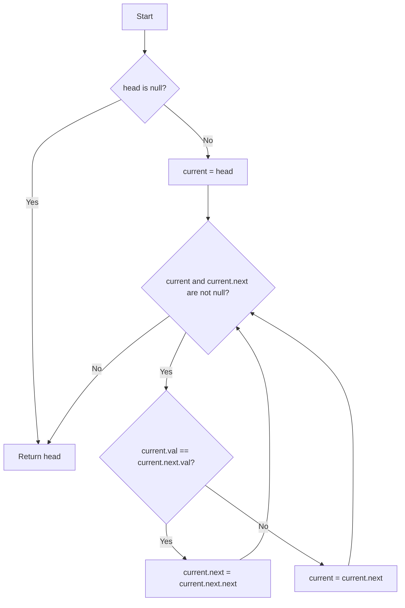

# 83. Remove Duplicates from Sorted List

Given the head of a sorted linked list, delete all duplicates such that each element appears only once. Return the linked list sorted as well.

## Example 1:

**Input:** head = [1,1,2]
**Output:** [1,2]

## Example 2:

**Input:** head = [1,1,2,3,3]
**Output:** [1,2,3]

## Constraints:

* The number of nodes in the list is in the range [0, 300].
* -100 <= Node.val <= 100
* The list is guaranteed to be sorted in ascending order.

---

## Intuition

The input is a sorted linked list, which means that any duplicate elements will be adjacent to each other. This is a key observation. I can iterate through the list and compare each node with the next one. If two adjacent nodes have the same value, I can remove the duplicate by skipping the next node.

## Approach

I will use a `current` pointer that starts at the `head` of the list. I'll traverse the list as long as `current` and `current.next` are not null. In each iteration, I'll check if `current.val` is equal to `current.next.val`.

If they are equal, it means I've found a duplicate. I'll remove the duplicate node by changing the `next` pointer of the `current` node to point to `current.next.next`. This effectively removes the `current.next` node from the list.

If the values are not equal, it means there's no duplicate, so I'll just move to the next node by setting `current = current.next`.

I will repeat this process until I reach the end of the list.

### Visual Logic

## Complexity

Let `N` be the number of nodes in the linked list.

*   **Time Complexity: O(N)**
    The algorithm iterates through the linked list once, so the time complexity is linear with respect to the number of nodes.

*   **Space Complexity: O(1)**
    The algorithm uses a constant amount of extra space. I'm modifying the list in-place, so I'm not using any additional data structures that scale with the input size.

## Key Learnings

*   **In-place modification:** This problem is a good example of modifying a data structure in-place to save space.
*   **Sorted input:** The fact that the input is sorted is a crucial piece of information that simplifies the problem significantly. It allows for a linear time solution by only comparing adjacent elements.
*   **Linked List manipulation:** This problem reinforces the basics of linked list traversal and manipulation, such as changing `next` pointers to remove nodes.