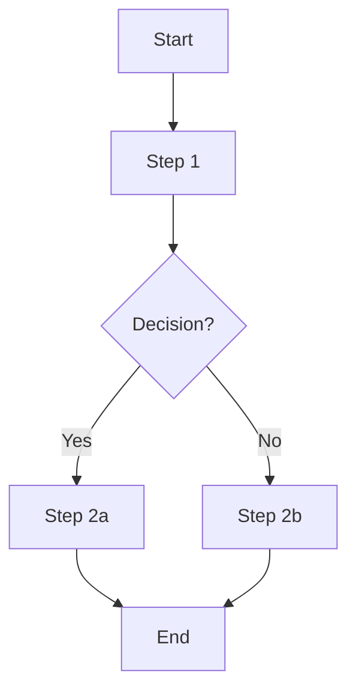

# [Problem Number]. [Problem Title]

[Problem Description from LeetCode]

## Example 1:

**Input:** 
**Output:** 

## Constraints:

*   

---

## Intuition

[Explain your initial thoughts, why a particular approach might be suitable, or what challenges the problem presents. Focus on the 'why' behind your chosen strategy.]

## Approach

[Describe the step-by-step algorithm or method you used to solve the problem. Be clear and concise. If applicable, refer to the visual logic diagram below.]

### Visual Logic

[Use Mermaid.js syntax here to create a flowchart or other diagram that visually represents your approach. This should be a high-level overview of the algorithm's flow.]

## Complexity

Let `N` be [define N, e.g., length of input array/string, number of nodes/edges, etc.].

*   **Time Complexity: O(...)**
    [Explain how you arrived at this complexity. Detail the operations that contribute to the time complexity.]

*   **Space Complexity: O(...)**
    [Explain how you arrived at this complexity. Detail any auxiliary space used by your algorithm.]

## Key Learnings

[Summarize the main takeaways from solving this problem. This could include:
*   Insights into specific data structures (e.g., hash maps, trees, graphs).
*   Algorithm patterns (e.g., two-pointers, dynamic programming, recursion).
*   Language-specific features or optimizations.
*   Common pitfalls to avoid.
*   How this problem relates to real-world scenarios.]
